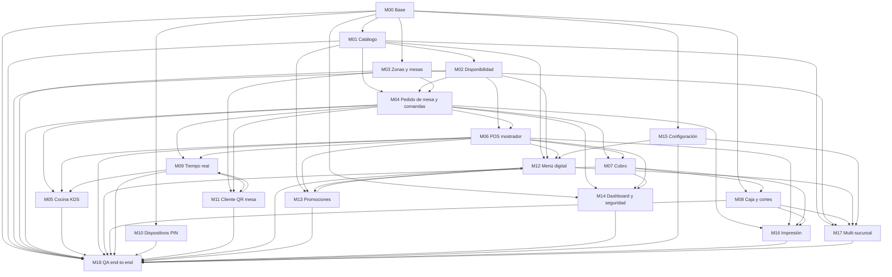

# Especificación del POS de Monky, por módulos

## Propósito

Esta carpeta contiene la especificación funcional completa del POS de Monky para restaurantes, dividida en 19 módulos (`M00` a `M18`). Cada archivo describe un área del sistema: datos, estados, reglas de negocio, permisos, pantallas, procesos, casos límite como requisitos, criterios de aceptación y una tabla de tareas lista para repartir entre agentes.

El objetivo es que cualquier agente (humano o de Claude Code) pueda tomar un módulo y construirlo sin necesitar más contexto que ese archivo y `M00-base.md`.

## Cómo la usan los agentes

- **Un módulo = un archivo.** Cada `Mxx-*.md` es autocontenido, salvo por su dependencia común de `M00-base.md` (roles, permisos y aislamiento por restaurante).
- **Una tarea = un PR.** Cada fila de la tabla de tareas de un módulo se implementa en su propia rama y su propio pull request, nunca varias tareas mezcladas en un solo PR.
- **Convención de ramas:** `feat/<Mxx>-<tarea>`, creada siempre desde `origin/main` actualizado (nunca sobre una rama de trabajo de otra tarea).
- **Migraciones de base de datos:** solo se aplican con el agente `db-architect`, pasan por revisión de `security-reviewer`, y requieren el visto bueno del jefe general de la sesión antes de aplicarse contra el proyecto de Supabase. Ningún otro agente aplica migraciones directamente.
- **QA:** todo flujo se prueba en el restaurante de pruebas `monky-qa`, nunca en el restaurante real en producción. Ver `app/TESTING.md` en la raíz del repo para credenciales de prueba y registro de qué ya se validó.
- **No se reescribe lo que ya funciona en producción.** Las áreas de dinero (cobro, caja, sesiones, reportes) siguen el patrón expand → deploy → contract: se agrega lo nuevo sin romper lo existente, se despliega, y solo después se retira lo viejo si ya no se usa.

## Módulos

| Código | Nombre | Estado en Monky | Depende de | Sprint |
|---|---|---|---|---|
| M00 | Base (negocio, sucursal, miembros, roles, permisos, auditoría) | Adaptar | — | S1 |
| M01 | Catálogo (categorías, productos, variantes, personalizaciones) | Adaptar | M00 | S1 |
| M02 | Disponibilidad (agotados) | Adaptar | M01 | S2 |
| M03 | Zonas y mesas | Nuevo | M00 | S2 |
| M04 | Pedido de mesa y comandas por ronda | Adaptar | M01, M02, M03 | S2 |
| M05 | Cocina (comandas digitales, KDS) | Adaptar | M04, M06, M09 | S3 |
| M06 | POS de mostrador y tipos de pedido | Adaptar | M00, M01, M02, M04 | S3 |
| M07 | Cobro | Existe | M04, M06, M08 | S3 |
| M08 | Caja y cortes | Existe | M00, M07 | S4 |
| M09 | Tiempo real y notificaciones | Existe | M04, M05, M06, M11 | S4 |
| M10 | Dispositivos vinculados y acceso por PIN | Nuevo | M00 | S4 |
| M11 | Cliente por QR de mesa | Adaptar | M03, M04, M09 | S5 |
| M12 | Menú digital: domicilio y para recoger | Nuevo | M01, M02, M06, M13 | S5 |
| M13 | Promociones | Nuevo | M01, M04, M06, M12 | S5 |
| M14 | Dashboard "Hoy" y seguridad | Existe | M00, M04, M06, M07 | S6 |
| M15 | Configuración general | Adaptar/Nuevo | M00 | S6 (transversal) |
| M16 | Impresión | Nuevo | M04, M06, M07, M08 | S6 |
| M17 | Multi-sucursal | Nuevo | M00, M01, M03, M08, M12, M15 | S6 |
| M18 | QA end-to-end | Nuevo | M00–M17 | S6 (validación final) |

## Diagrama de dependencias

## Tablero de tareas

Tablero de tareas: Notion (privado).
